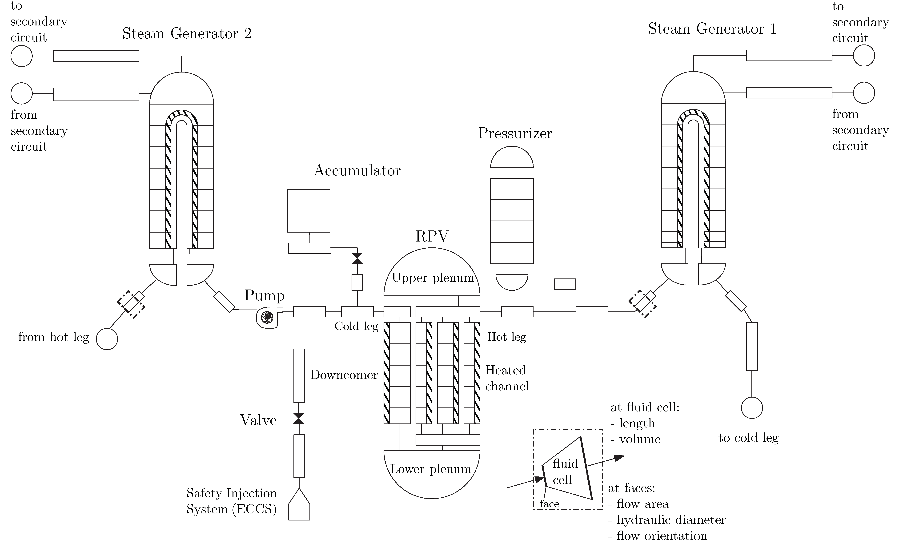
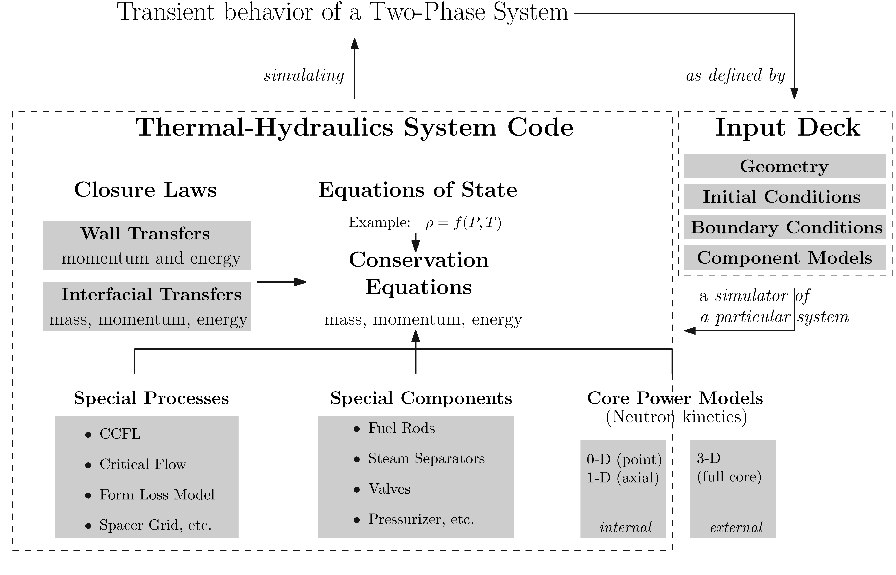

.. _intro_computer_simulation:

Computer Simulation and Safety Analysis of Nuclear Power Plant
==============================================================

Scientific Computer Simulation
------------------------------

.. A definition

The ubiquity of computer simulation in science and engineering has resulted in numerous definitions of the term *scientific computer simulation*, *model*, and *simulation*.
To avoid confusion, this thesis adopts a recent definition proposed by Kaizer et al. :cite:`Kaizer2015` quoted below:

.. epigraph::

   Scientific Computer Simulation is the imitation of a behavior of a system, entity, phenomenon, or process in the physical universe 
   using limited mathematical concepts, symbols, and relations through the exercise or use of scientific computer model.
	
.. The definition, explained

This definition highlights three main points.
First, this definition accentuates the difference between *model* and *simulation*.
A model deals with the notion of representation of a system, while a simulation deals with the notion of imitation of a behavior of that system.
Secondly, a model is said to be scientific when it represents a real world system as its subject.
Finally, the modifier *computer* generally implies that the mathematical models cannot be solved analytically and their solutions require a computer.
Because the associated numerical approximations can affect its solution, many computational-related aspects often need to be considered.
This thesis only deals with computer simulation.

.. A distinction by Beven

Beven :cite:`Beven2009` articulates this definition of a scientific model further through the following distinctions: a perceptual model (i.e., the theoretical description of the physical phenomena),
a formal model (i.e., its mathematical description),
and a procedural model (i.e., the computer implementation of the formal model).
For many physical models of complex system, only the procedural model is able to make a quantitative prediction of the system behavior.
These distinctions are useful in acknowledging the level of approximation involved in modeling.

.. Code

A computer software that implements scientific models down to the solution algorithms is called a *scientific code* or simply a *code* :cite:`Trucano2006`.
Many modern implementations of scientific codes, apart from possibly being specific to a scientific domain, are comprehensive platforms.
For instance, in the context of thermal-hydraulics (:term:`TH`) system modeling, such codes allow modeling various attributes of the system ranging from its geometry, initial and boundary conditions, and design variables to the settings for discretization scheme and numerical solver.

.. Simulator

A *simulation* or a *calculation* :cite:`Trucano2006` using a code can only be made on a particular well-specified system, where all the aforementioned attributes (geometry, initial and boundary conditions, etc.) have been completely fixed or specified.
As a result, the terms *computer simulation model* or *simulator* include not only the code itself, but also the particular system of interest being modeled using the code :cite:`OHagan2006`.

Codes and Safety Analysis of Nuclear Power Plant
------------------------------------------------

.. Goal of simulation and entry to safety analysis

Scientific codes play a central role in deterministic safety analysis of nuclear power plants (NPPs).
They provide a *physics-based* evaluation of relevant phenomena taking place in the plant during postulated transients to demonstrate that safety requirements are met :cite:`IAEA2009`.
The demonstration is carried out with respect to acceptance criteria, a set of limits and conditions ensuring the integrity of the safety barriers.
The criteria are set by regulatory bodies for normal and off-normal operation of the plants.

.. Deterministic safety analysis

The physics-based evaluation is achieved through simulation.
As noted in :cite:`IAEA2009,DAuria2012`, there are four disciplines associated with the different physical processes relevant in the safety analysis of the plant behavior:
the *neutronics* of the core;
the *thermo-mechanics* of the fuel and reactor components;
the *radiological* analysis of a possible release;
and, the *system thermal-hydraulics* of the plant, the subject of this thesis [*]_.
Each discipline is, in turn, characterized by a distinct set of governing physical equations and that are often solved by a distinct code.

.. Entry to Conservative vs Best Estimate

The :term:`NPP` safety is established, among other things, by setting the acceptance criteria in terms of limiting physical quantities relevant for the phenomena involved.
The upper tolerance limit of :math:`1'204\,[^oC]` for the peak clad temperature (:term:`PCT`) is one such criteria for light water reactors (:term:`LWR`) :cite:`USNRC2017`.
Whether the physical quantities respect such limits during postulated scenarios is analyzed using simulations either in a conservative or best-estimate approach :cite:`IAEA2009`.

.. Conservative Analysis

During its early days, reactor safety analysis involved a high-degree of conservatism.
Conservatism called for the most pessimistic and penalizing modeling assumptions (including initial and boundary conditions) to ensure conservative results, that is far below their expected values.
This approach, was justified by limited modeling capabilities and limited knowledge of the physical process involved.
However, it was later found that there are conditions for which conservative assumptions do not lead to conservative (or even physical) predictions.

.. An Illustration

As an example, consider the analysis for a :term:`LOCA` of an :term:`LWR`.
Assuming less interfacial shear between the liquid and the gas phases of the coolant (water) reduces mist flow and is a conservative assumption because less heat is transferred to the coolant flow in the upper region of the core, which penalizes the fuel temperature prediction.
But this assumption also reduces that the time to refill the core as more liquid is retained in the reactor cooling system.
Furthermore, with less shear, there is less resistance in injecting emergency coolant into the core (condition known as the counter-current flow limitation).
Both effects are clearly not conservative and put into question the conservatism of the prediction :cite:`IAEA2009`.

.. Best-estimate Analysis

Because of this example and many others :cite:`IAEA2009`, a more accurate prediction of two-phase flow transient behavior under accident conditions was deemed necessary.
As opposed to the conservative approach, *best-estimate* approach calls for (more) physically sound thermal-hydraulics models with more realistic assumptions, which are backed up by experimental data obtained from numerous experimental programs conducted in Separate and Integral Effect Test Facilities.
In that context, Best-estimate :term:`TH` system codes were developed to provide more realistic predictions.
The codes were designed to be comprehensive tools capable of simulating realistically a wide range of transients foreseen in :term:`LWR` operation,
and were developed using the current best understanding of flow processes expected to happen during the transients.

.. _sub_intro_th_system_code:

Thermal-Hydraulics (TH) System Codes
------------------------------------

.. Thermal-Hydraulics System Code, what and why

A :term:`TH` system code is a tool to simulate the flow behavior of the reactor coolant during transients.
This implies solving time-dependent conservation equations, describing the two-phase fluid flow inside the coolant circuit, coupled with a heat conduction equation, describing the heat transfer between fluid and heated elements (e.g., fuel rods).
The simulation of the plant behavior also requires an explicit modeling of the geometry, components, equipments, and systems that are specific to :term:`LWRs` :cite:`DAuria2012`.  

.. Nodalization

The coolant circuit of an :term:`LWR` is a complex system.
The system includes the reactor pressure vessel with hundreds of fuel assemblies; kilometers of interconnecting pipes; scores of valves, pumps, and tanks; as well as numerous special components like steam generators and condensers.
The first major simplification made for describing the fluid flow in the coolant circuit is to average the fluid on the surface perpendicular to its flow (i.e., *flow area averaging* -- see :ref:`trace_reflood`). 
This results in a 1-dimensional *nodalization* of the circuit.
Through nodalization, an :term:`LWR` is decomposed into a set of interconnected *nodes* which holds discretized information of fluid flow (see :numref:`fig_ch1_nodalization`).
Due to the 1-dimensional simplification of the flow [*]_, a node is only characterized by its *fluid cell* (with attributes of length and free volume) and its *faces* (with attributes of flow area, hydraulic diameter, and orientation). 

.. _fig_ch1_nodalization:

   Nodalization of an :term:`NPP` in a :term:`TH` system code.
   Shaded elements are heated elements, where heat exchange occurs between the element and the fluid.

.. Structure of a system code

The typical structure of a system code is illustrated in :numref:`fig_ch1_th_system_code`.
As shown, a system code constitutes of several building blocks that can be used to model and simulate wide ranges of systems and conditions.
It includes a set of conservation equations, closure laws, and equation of states.
System codes are complemented with models for special components that perform specific functions (e.g., heated solid structure, pumps, and separators) or actions during transients (e.g., valves, instrumentation, and control systems);
and models for special processes and phenomena that are relevant to the :term:`LWR` but too complex to be captured implicitly in the (simplified) conservation equations (e.g., critical flow).
In fact, the inclusion of models for those components and processes are the defining characteristics of :term:`TH` system code :cite:`DAuria2012`.

.. _fig_ch1_th_system_code:

   Generic structure of a :term:`TH` system code.
   The code and an input deck define a *simulator* of a system.

.. Constitutive Equations and the Two-fluid Model

The core element of a system code is a set of conservation equations describing the dynamics of the state variables of the fluid.
The state-of-the-art model widely implemented in :term:`TH` system codes to describe the dynamics of fluid flow in :term:`NPPs` (specifically, :term:`LWR`) is based on the *two-fluid* model.
This model separately treats the transport phenomena of the two-phases of fluid flow (gas and liquid) resulting in a set of six balance equations (mass, momentum, and energy for each of the two phases).
The model can capture phenomena where thermal and mechanical non-equilibrium conditions exist between the two phases, giving more realistic picture in a wide range of transients.

.. Validity of Two-fluid Model

The validity of the two-fluid model relies on the proper modeling of the transfer terms between phases and between each phase and the boundary walls.
The transfer terms include interfacial drag, interfacial heat transfer, and wall heat transfer.
In principle, any two-phase flow pattern exhibits particular phase distributions and interfacial structures.
As a result, the mathematical expressions of the transfer terms change with the pattern of the two-phase flow.
As the transfer terms represent different physical processes taking place for each flow pattern, they constitute the *physical model* of a system code.

.. Closure Laws, fully empirical

These physical models, so-called *closure laws*, close the set of balance equations for mass, momentum, and energy of the two phases.
Based on their origins, closure laws can be classified into three categories: fully empirical, fully mechanistic, and semi-empirical :cite:`Bestion2008`.
Fully empirical closure laws are based only on the available representative experimental data by correlating transfer terms of interest with observed flow variables.
Given comprehensive experimental data, these models tend to be accurate within the range of experimental conditions (i.e., its validation domain).
On the other hand, an extrapolation outside of that range can give dubious results.

.. fully mechanistic

A fully mechanistic (i.e., *phenomenological*) approach for developing closure laws lies at the other end of the spectrum.
Using this approach, a physical mechanism that governs the phenomena of interest is postulated.
Experimental data plays a role only in validating such a postulated model.
If the model cannot be supported by the data then a complete revision might be required.
Mechanistic approach to closure laws modeling provides a scientific basis for prediction outside the validation data range (i.e., extrapolation). 
However, its quality strongly depends on the adequacy of the postulated model and the associated assumptions.

.. semi-empirical approach

Lastly, the semi-empirical approach combines both approaches, i.e., an initial mechanistic model which is tuned using parameters that are fitted to match experimental data.
These parameters then become a measure of the inadequacy of the postulated model in explaining the data due to any unaccounted physical processes.

.. Source of uncertainty

Any of these approaches proved to be a difficult effort :cite:`Barre1990,Nelson1992,Wulff2007` due to various reasons ranging from the lack of knowledge of the underlying physical process (with respect to the fully mechanistic modeling) to limitation in the amount and precision of the measured data (with respect to the fully empirical approach).
Simplifying assumptions and extrapolations are made because of these limitations.
In the end, closure laws in system codes are of mixed origins and they become a major source of uncertainty [*]_ in the application of :term:`TH` system codes, especially when used outside their validation domains.

.. [*] Ref. :cite:`DAuria2012` added one additional key discipline, namely: *reliability analysis*. It is excluded in the above listing as it is not technically a discipline of *physics*.
.. [*] Some system codes allow a 3-dimensional modeling for selected components, mainly the reactor pressure vessel where 3-dimensional effects might be of relevance to safety analysis. However, as of today, no system code supports full 3-dimensional modeling of all the components in the coolant circuit.
.. [*] Defined in this thesis as a state of limited knowledge, that is of *epistemic* nature.