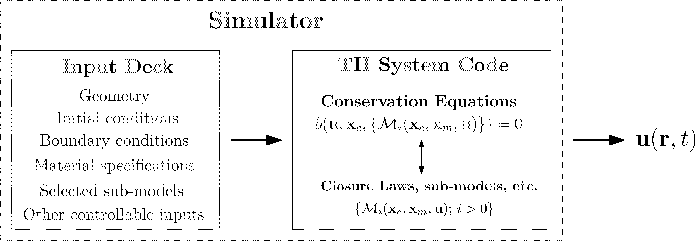

.. _intro_uq_in_ne_th:

Uncertainty Quantification in Nuclear Engineering Thermal-Hydraulics
====================================================================

.. Introductory Paragraph

Before continuing the discussion of uncertainty analysis of code predictions, this section defines some additional terminologies to avoid later confusion.

The notion of *simulator* introduced in :ref:`intro_computer_simulation` is depicted in a more generic way, as an input/output model in :numref:`fig_ch1_simulator_io`.

.. _fig_ch1_simulator_io:

	Simplified illustration of a simulator as an input/output model.

The input deck defines a specific problem (i.e., system) of interest and can be seen as the input of :term:`TH` codes.
It includes the geometrical configuration (i.e., the nodalization), the material and fluid involved, the initial and boundary conditions, and possibly the settings for the numerical solver.
Some of these specifications (such as the boundary conditions) are parametrized and constitutes *controllable inputs* denoted by :math:`\boldsymbol{x}_c`.
The simulator is to be run for a given controllable input value [*]_.
The conservation equations of the code are closed with additional set of closure laws (and other sub-models) :math:`\mathcal{M}_i(\boldsymbol{x}_c, \boldsymbol{x}_m, \boldsymbol{u})`.
These closure laws are, in turn, parametrized by a set of model specific parameters denoted by :math:`\boldsymbol{x}_m` which are referred to as the *physical model parameters*.
Both the controllable inputs and the physical model parameters are considered by the code as *inputs*.
 
Specifying the input deck, as far as the user is concerned,
completely defines the problem and the code solves the conservation equations :math:`b` (:numref:`fig_ch1_simulator_io`) to estimate the physical variables :math:`\boldsymbol{u}(\boldsymbol{r}, t)`
(where :math:`\boldsymbol{r}` and :math:`t` denote space and time variables, respectively) associated with the fluid flow and heat structure (e.g., fluid pressure, temperature, wall temperature, etc.).
These \"raw\" outputs are further post-processed to obtain relevant :term:`QoIs` for the problem at hand (e.g., max. temperature, max. pressure, onset time, etc.).

.. [*] Later on, *controllable* inputs correspond to the parameters whose counterparts in a physical experiment which can be controlled by the experimentalist.
