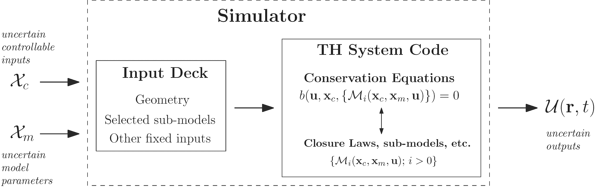

.. _intro_uq_in_ne_th:

Uncertainty Quantification in Nuclear Engineering Thermal-Hydraulics
====================================================================

.. Introductory Paragraph

Before continuing the discussion of uncertainty analysis of code predictions, this section defines some additional terminologies to avoid later confusion.

The notion of *simulator* introduced in :ref:`intro_computer_simulation` is depicted in a more generic way, as an input/output model in :numref:`fig_ch1_simulator_io`.

.. _fig_ch1_simulator_io:

.. figure:: ../_static/images/simulator_io.png

	Simplified illustration of a simulator as an input/output model.

The input deck defines a specific problem (i.e., system) of interest and can be seen as the input of :term:`TH` codes.
It includes the geometrical configuration (i.e., the nodalization), the material and fluid involved, the initial and boundary conditions, and possibly the settings for the numerical solver.
Some of these specifications (such as the boundary conditions) are parametrized and constitutes *controllable inputs* denoted by :math:`\boldsymbol{x}_c`.
The simulator is to be run for a given controllable input value [*]_.
The conservation equations of the code are closed with additional set of closure laws (and other sub-models) :math:`\mathcal{M}_i(\boldsymbol{x}_c, \boldsymbol{x}_m, \boldsymbol{u})`.
These closure laws are, in turn, parametrized by a set of model specific parameters denoted by :math:`\boldsymbol{x}_m` which are referred to as the *physical model parameters*.
Both the controllable inputs and the physical model parameters are considered by the code as *inputs*.
 
Specifying the input deck, as far as the user is concerned,
completely defines the problem and the code solves the conservation equations :math:`b` (:numref:`fig_ch1_simulator_io`) to estimate the physical variables :math:`\boldsymbol{u}(\boldsymbol{r}, t)`
(where :math:`\boldsymbol{r}` and :math:`t` denote space and time variables, respectively) associated with the fluid flow and heat structure (e.g., fluid pressure, temperature, wall temperature, etc.).
These \"raw\" outputs are further post-processed to obtain relevant :term:`QoIs` for the problem at hand (e.g., max. temperature, max. pressure, onset time, etc.).

.. _sub_intro_uq_forward:

Forward Uncertainty Quantification
----------------------------------

.. Best-estimate, limitation

Best-estimate analysis attempts to describe as realistically as possible the behaviors of the physical processes that occur during a plant transient.
And yet, neither complete understanding nor enough data is always available to adequately simulate these complex physical phenomena.
Simplifying assumptions, approximations, and expert judgments remain to some degree unavoidable for a complete analysis.

.. Best-estimate, plus uncertainty

Hence, best-estimate analysis has to be complemented with uncertainty analysis.
The ultimate goal of uncertainty analysis is to associate code prediction a with its uncertainty.
These combined quantities are then compared with safety limits (e.g., :term:`PCT`) to check whether the limits still fall outside the uncertainty band of the code prediction.

.. Source of possible uncertainties

There are several known sources of uncertainty that render the prediction on :math:`\boldsymbol{u}(\boldsymbol{r},t)` and its derived quantities uncertain.
The sources of primary interest in the present research are:

 1. *Uncertainty associated with the controllable inputs*.
 In the case of a controlled experiment, controllable inputs are observed and *controlled* for.
 However, their observations might contain errors due to instrument imprecision or inherent variability. 
 When simulating a real accident scenario in a plant, plant parameters prior to the accident scenario can also be measured and constitute uncertain controllable inputs.
 In addition, parameters defining the accident scenario, such as the break size in a :term:`LOCA`, or the availability and performance of safety systems can also be treated as uncertain controllable inputs :cite:`IAEA2002`.

 2. *Uncertainty associated with the physical model parameters*.
 The value of the physical model parameters are often not known a priori.
 Thus, the uncertainties are epistemic.
 They can either be estimated using data from a calibration experiment or by expert judgment.
	
 3. *Uncertainty associated with the physical models*.
 The physical models themselves are still approximations, even with perfectly known model parameters.
 If derived in a fully mechanistic manner, some important processes might be unaccounted for due to the inherent complexity and lack of knowledge (i.e., the case of *missing physics*).
 On the contrary, if derived fully empirically, models might be derived separately for different elementary processes, while in the applications of the code multiple such models are used in concert.
 Despite each being validated, it is fair to question the validity of models used in an ensemble.
 Any of the two tends to cause a systematic bias on the code prediction, the extend of which is unknown and uncertain.
 As a result, this source of uncertainty is referred to as model *bias*, *inadequacy*, or *discrepancy*.

.. Forward uncertainty quantification, Inputs as random variables

In uncertainty analysis, the controllable inputs and physical model parameters are modeled as random variables (:math:`\boldsymbol{\mathcal{X}}_c` and :math:`\boldsymbol{\mathcal{X}}_m`, respectively) equipped with probability density functions (:term:`PDFs`).
By transforming the random variable inputs, the simulator output becomes random variable as well

.. math::

	\boldsymbol{\mathcal{U}}(\boldsymbol{r}, t) = f(\boldsymbol{\mathcal{X}}_c, \boldsymbol{\mathcal{X}}_m;\boldsymbol{r}, t)

where :math:`f` represents the simulator as a mathematical function.
The :term:`QoI` related to the random outputs can be summarized by different integral quantities.
For instance, the mean of a :term:`QoI` given by function :math:`g` is

.. math::

	\mathbb{E}[g] = \int\limits_{\mathbf{X}_c,\mathbf{X}_m} g(f(\boldsymbol{x}_c, \boldsymbol{x}_m;\boldsymbol{r}, t)) \, p(\boldsymbol{x}_c, \boldsymbol{x}_m) \, d\boldsymbol{x}_c \, d\boldsymbol{x}_m

where :math:`p(\boldsymbol{x}_c, \boldsymbol{x}_m)` denotes the joint :term:`PDF` for the input parameters.

Using Monte Carlo (:term:`MC`) techniques, samples are generated from the joint input parameters distribution and are used to run the code multiple times.
Afterward, the resulting code outputs (raw or post-processed), are summarized to obtain the uncertainty measure of the prediction.
In other words, the uncertainties in the controllable inputs and physical model parameters are *propagated forward* through the code to quantify the uncertainty of the predictions as shown in :numref:`fig_ch1_simulator_uq_forward`.
The practice of propagating parametric uncertainty by :term:`MC` is widely accepted in the nuclear engineering thermal-hydraulics community :cite:`Lellouche1990,Glaeser1994,Wallis2007,Glaeser2008`.

.. _fig_ch1_simulator_uq_forward:

    Simplified flowchart of forward uncertainty quantification of a simulator prediction. Notice that the simulator has been parametrized by the controllable inputs and physical model parameters, each of which are represented as a random variable.

.. _sub_intro_uq_inverse:

Inverse (Backward) Uncertainty Quantification
---------------------------------------------

.. Model parameters

A lot has been said about the origin of the uncertainty associated with the controllable inputs.
The physical model parameters, however, are conceptually different.
The physical models referred to in this thesis are usually represented either in the form of correlations, phenomenological models, or a mixed between the two (see :ref:`sub_intro_th_system_code`).
Therefore, the model parameters do not necessarily have a physical meaning (see :ref:`ch_bayesian_calibration`) and the source of their uncertainties vary with the type of model.
For instance, in an empirical model the model parameters are the curve-fitting parameters and their uncertainties are observable and can be associated with the dispersion of the data.

.. Representativity for NPP application

However, many physical models, be it empirical or mechanistic, are originally derived from experiments on simple systems that do not, strictly speaking, reflect the flow conditions in an :term:`LWR` (e.g., heated tube vs. rod bundle, low pressure vs. high pressure, etc.) :cite:`Bestion2008`.
Thus, to better represent the flow characteristics in reactor transient,
experiments with well-specified conditions are conducted in \glspl[hyper=false]{setf}, facilities aimed at reproducing a particular safety-relevant phenomena during transient at a particular part of the reactor :cite:`DAuria2012`.

The data are used to assess the physical models.
In the assessment,
some parameters in the models are adjusted to match the experimental data :cite:`Barre1990`.
Alternatively, additional free parameters can be introduced in the models to serve the same purpose :cite:`Bestion2008`.
That is, the parameters are tuning parameters and become measures of the models inadequacy in reproducing the data.
Ultimately, optimal values for the parameters are estimated and implemented in the code.

.. Origin of uncertainty

In light of this, it can be argued that the uncertainty associated with the tuning parameters stems from the fact that the calibration was conducted only on limited set of data obtained from selected \glspl[hyper=false]{setf}.
As different \glspl[hyper=false]{setf} exist for the same phenomena, it is fair to ask if the calibrated value will hold if the calibration were to be conducted on other \glspl[hyper=false]{setf} data.
Additionally, as tuning parameters, expert-judgment is also often used to estimate the uncertainty.
Experts fixed the range of variation of the parameters based on their expectation of the model performance.

.. Inverse uncertainty

To derive the uncertainty associated with the model parameters described above, the problem can be posed as an inverse problem.
\marginpar{An inverse problem}
In this setting, given a set of experimental data $\{\mathbf{D}\}$ taken with known controllable inputs $\mathbf{x}_c$, the task is to infer the value of the \emph{unobserved} parameters in the physical model used to predict the same quantity as the experimental data.
To avoid excessive bias towards the calibration data, it is important here to acknowledge the observation errors of the experimental data and the controllable inputs, and the possible systematic bias of the associated models.

% Bayesian framework
In a probabilistic setting, a way to make an inference of unobserved parameters based on observed data is
\marginpar{Inverse uncertainty quantification}
through the Bayes' theorem,
\begin{equation*}
	p(\bm{x}_m\,|\,\{\mathbf{D}\},\mathbf{x}_c) = \frac{p(\{\mathbf{D}\}\,|\,\bm{x}_m, \mathbf{x}_c) \cdot p(\bm{x}_m)}{\int p(\{\mathbf{D}\}\,|\,\bm{x}_m, \mathbf{x}_c) \cdot p(\bm{x}_m)\,d\bm{x}_m}
\end{equation*}
where the left-hand side of the equation is the posterior probability density of the model parameters $\bm{x}_m$ conditioned on the observed data $\{\mathbf{D}\}$ and controllable inputs $\mathbf{x}_c$.
The right-hand side constitutes of the likelihood function $p(\{\mathbf{D}\}\,|\,\bm{x}_m, \mathbf{x}_c)$ (probability of observing data given the parameters), the prior of the model parameters $p(\bm{x}_m)$ (the initial state of knowledge regarding the parameters values before observing the data),
while the denominator is a normalizing constant such that the posterior is a valid \gls[hyper=false]{pdf} (that is, it integrates to one)\footnote{Note that the formulation assumes the controllable inputs $\mathbf{x}_c$ are fully known. If they are considered uncertain, such as due to their inherent variability, then a prior probability can be put on them as well.}.
The posterior represents the knowledge one has on the model parameters values conditioned on the data under the modeling assumption.
Fig.~\ref{fig:ch1_simulator_uq_inverse} depicts a simplified flowchart of the inverse quantification.
\bigfigure[pos=tbhp,
           opt={width=1.0\textwidth},
           label={fig:ch1_simulator_uq_inverse},
           shortcaption={Simplified flowchart of inverse uncertainty quantification of model parameters.}]
{../figures/chapter1/figures/simulator_uq_inverse}
{Simplified flowchart of inverse quantification for model parameters of a simulator.}

The formulation and computation of the posterior above can be seen as a calibration exercise.
\marginpar{Statistical calibration}
That is, it seeks to adjust the model parameters such that the predictions of the simulator are consistent with the observed (i.e., calibration) data under the assumed likelihood and the prior.
However, instead of obtaining a single estimated value (or values in case of multiple parameters), the resulting posterior is a joint \gls[hyper=false]{pdf}, conditioned on the observed data.
In relation to the aforementioned expert-judgment for estimating the parameters uncertainty, the approach uses the experimental data to better inform the prior expectation about the model parameters values.
The posterior \gls[hyper=false]{pdf}, in turn, can be used in uncertainty propagation to quantify the uncertainty on the prediction made outside the calibration data.

.. Connection to PREMIUM Benchmark

The importance of characterizing the uncertainty in the physical models parameters was acknowledged by the :term:`WGAMA` of the :term:`OECD`/:term:`NEA`.
This led to the :term:`PREMIUM` project.
Its main goal is to report the state-of-the-art methodologies to quantify the uncertainty in the physical models parameters.
The following will briefly describe the project and highlight the selected main lessons learned from the author's perspective through his participation on behalf of the :term:`PSI` :cite:`Wicaksono2016a`.

.. [*] Later on, *controllable* inputs correspond to the parameters whose counterparts in a physical experiment which can be controlled by the experimentalist.
